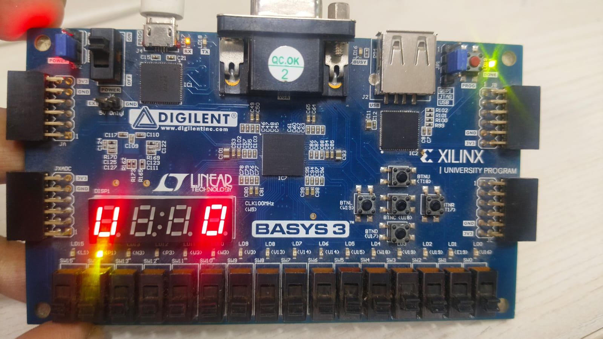
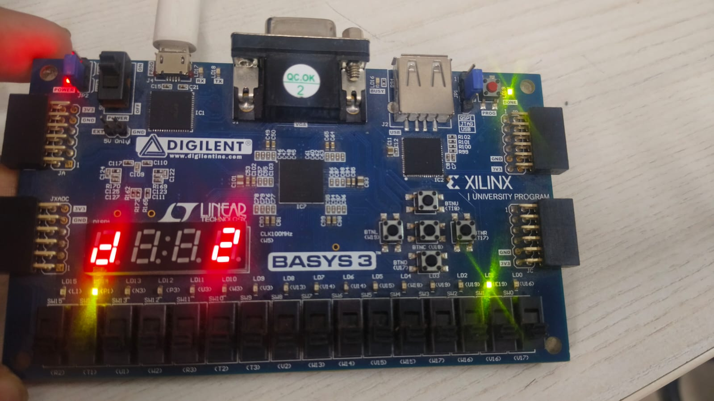

# Real-Time FSM based Smart Elevator Monitoring and Predictive Maintenance System implemented on FPGA

[]()
[]()
[]()
[]()
[]()
[]()

---

# Overview

This project implements a **5-floor intelligent elevator controller** using a **Finite State Machine (FSM)** on a **Xilinx Artix-7 FPGA (Digilent Basys 3 board)**.

The system combines:

* **Digital hardware design using Verilog HDL**
* **Real-time FPGA control logic**
* **UART-based telemetry**
* **Python serial communication**
* **WebSocket networking**
* **A modern browser-based monitoring and Smart analytics dashboard**
* **Predictive Maintenance Engine**

The elevator controller is capable of:

* Handling multiple floor requests
* Managing cabin and hall calls
* Controlling elevator movement direction
* Door operation logic
* Emergency stop handling
* Real-time state visualization

Unlike traditional microcontroller implementations, this project executes entirely in hardware using FPGA-based parallel digital logic, providing deterministic timing and highly responsive control behavior.

---

# Project Highlights

## Core FPGA Features

* FSM-based elevator controller
* 5-floor support (0–4)
* Internal cabin requests
* External hall UP/DOWN requests
* Real-time movement scheduling
* Direction persistence logic
* Dynamic request aggregation
* Emergency stop and nearest-floor logic
* Door timing mechanism
* Clock division and timing control
* Multiplexed 7-segment display control
* LED status indicators

---

## Communication Features

* UART telemetry at 9600 baud
* FPGA → PC serial communication
* 4-byte compact telemetry protocol
* Frame synchronization support
* Real-time telemetry streaming (~10 Hz)

---

## Software Features

* Python UART bridge
* WebSocket server
* JSON-based state broadcasting
* Live browser updates
* UART debugging utility

---

## Monitoring Dashboard Features

* Animated elevator shaft
* Real-time cabin movement
* Door open/close animations
* Hall button indicators
* Cabin request indicators
* Emergency alarm system
* Live direction status
* Maintenance recommendations
* Demo mode when FPGA disconnected

---

# System Architecture

The system is divided into three major layers:

```text
+------------------------------------------------------+
|                  Browser Dashboard                   |
|        HTML + CSS + JavaScript + WebSocket           |
+------------------------------------------------------+
                        ▲
                        │ WebSocket
                        ▼
+------------------------------------------------------+
|            Python UART-WebSocket Bridge              |
|      PySerial + AsyncIO + WebSockets + JSON          |
+------------------------------------------------------+
                        ▲
                        │ UART @ 9600 baud
                        ▼
+------------------------------------------------------+
|                FPGA Elevator Controller              |
|       Verilog FSM running on Basys 3 FPGA            |
+------------------------------------------------------+
```

---

# Elevator FSM Design

The elevator behavior is modeled using a **Finite State Machine (FSM)**.

## Major Operational States

| State          | Description                    |
| -------------- | ------------------------------ |
| IDLE           | Elevator waiting for requests  |
| MOVING_UP      | Elevator travelling upward     |
| MOVING_DOWN    | Elevator travelling downward   |
| DOOR_OPEN      | Door opened at requested floor |
| EMERGENCY_STOP | Emergency state handling       |

---

# Hardware Platform

## FPGA Board

### Digilent Basys 3

* FPGA: Xilinx Artix-7 XC7A35T
* 100 MHz onboard clock
* Push buttons
* Slide switches
* LEDs
* 4-digit 7-segment display
* USB UART support

---

# Technologies Used

| Technology  | Purpose                           |
| ----------- | --------------------------------- |
| Verilog HDL | FPGA hardware design              |
| Vivado      | FPGA synthesis and implementation |
| FSM         | Elevator control logic            |
| UART        | Serial telemetry                  |
| Python      | Communication bridge              |
| PySerial    | UART communication                |
| AsyncIO     | Asynchronous server               |
| WebSockets  | Real-time browser updates         |
| HTML/CSS/JS | Monitoring dashboard              |

---

# Repository Structure

```text
.
├── README.md
├── UI/
│   ├── index.html
|   ├── Analytics.html
│   ├── main.py
│   └── uart_test.py
│
└── project_4/
    ├── project_4.xpr
    │
    ├── project_4.srcs/
    │   ├── constrs_1/
    │   │   └── lift_basys3.xdc
    │   │
    │   └── sources_1/
    │       ├── lift_fpga_top.v
    │       ├── Lift8.v
    │       ├── floor_logic.v
    │       ├── request_logic.v
    │       └── uart_tx.v
    │
    └── project_4.runs/
```

---

# Verilog Module Description

# 1. `lift_fpga_top.v`

Top-level FPGA integration module.

## Responsibilities

* Integrates all Verilog modules
* Maps Basys3 hardware interfaces
* Controls LEDs and displays
* Generates UART telemetry packets
* Handles emergency latch logic
* Manages clock division

## Features

* UART telemetry sequencer
* 7-segment display controller
* Direction indicators
* OPEN/STOP display logic
* Clock divider generation

---

# 2. `Lift8.v`

Main elevator controller FSM.

## Responsibilities

* Elevator movement logic
* Request processing
* Floor tracking
* Direction management
* Emergency operation
* Door handling

## Key Logic

### Request Aggregation

```verilog
all_requests <= next_cabin | next_up | next_down;
```

### Direction Control

```verilog
if (Down && (min_request < current_floor))
```

### Emergency Handling

```verilog
if (emergency_stop) emergency_mode <= 1;
```

---

# 3. `request_logic.v`

Request analysis module.

## Responsibilities

* Combines all requests
* Finds highest requested floor
* Finds lowest requested floor
* Assists scheduling decisions

## Outputs

* `requests_out`
* `max_out`
* `min_out`

---

# 4. `floor_logic.v`

Floor stopping decision module.

## Responsibilities

* Determines stop conditions
* Triggers door opening
* Generates idle signals

---

# 5. `uart_tx.v`

UART transmitter module.

## Features

* 8N1 UART protocol
* 9600 baud communication
* FSM-based transmission
* Start bit generation
* Stop bit generation
* Busy signaling

## UART FSM States

| State     | Purpose          |
| --------- | ---------------- |
| IDLE      | Waiting for data |
| START_BIT | Send start bit   |
| DATA_BITS | Send 8 data bits |
| STOP_BIT  | Send stop bit    |
| CLEANUP   | Return to idle   |

---

# UART Communication Protocol

The FPGA transmits a **4-byte telemetry frame**.

---

## Byte 0 — Status Byte

| Bit | Description           |
| --- | --------------------- |
| 7   | Start-of-frame marker |
| 6   | Emergency active      |
| 5   | Door open             |
| 4   | Moving up             |
| 3   | Moving down           |
| 2:0 | Current floor         |

---

## Byte 1 — Cabin Requests

| Bit | Description    |
| --- | -------------- |
| 4:0 | Cabin requests |

---

## Byte 2 — Hall UP Requests

| Bit | Description      |
| --- | ---------------- |
| 4:1 | Hall UP requests |
| 0   | Idle status      |

---

## Byte 3 — Hall DOWN Requests

| Bit | Description        |
| --- | ------------------ |
| 4:1 | Hall DOWN requests |

---

# Real-Time Monitoring Dashboard

The dashboard provides a real-time animated visualization of the elevator system.

## Features

* Elevator shaft animation
* Cabin movement animation
* Door open/close animation
* Hall button lighting
* Cabin button indicators
* Emergency alarm effects
* Live floor tracking
* Direction indicators
* Demo simulation mode

---

# Python UART-WebSocket Bridge

The Python bridge performs:

1. UART data reception
2. Frame synchronization
3. Frame parsing
4. JSON serialization
5. WebSocket broadcasting

---

# Example JSON State

```json
{
  "floor": 2,
  "up": true,
  "down": false,
  "door": false,
  "idle": false,
  "emergency": false,
  "cabin_req": [false, true, false, true, false],
  "hall_up": [true, false, false, false],
  "hall_down": [false, false, true, false]
}
```

---

# FPGA Inputs and Outputs

# Inputs

| Component         | Purpose            |
| ----------------- | ------------------ |
| Switches SW0–SW4  | Cabin requests     |
| Switches SW5–SW8  | Hall UP requests   |
| Switches SW9–SW12 | Hall DOWN requests |
| BTN_C             | System reset       |
| BTN_U             | Emergency stop     |

---

# Outputs

| Component | Purpose                |
| --------- | ---------------------- |
| LEDs      | Current floor          |
| LED14     | Idle indicator         |
| LED15     | Door open indicator    |
| 7-Segment | Floor/status display   |
| UART TX   | Telemetry transmission |

---

# 7-Segment Display Behavior

| Display      | Meaning          |
| ------------ | ---------------- |
| Floor Number | Current floor    |
| OPEN         | Door open        |
| STOP         | Emergency active |
| RST          | Reset state      |

---

# Clocking System

The FPGA uses:

| Clock         | Purpose              |
| ------------- | -------------------- |
| 100 MHz       | Main system clock    |
| Slow Clock    | Elevator movement    |
| Display Clock | Display multiplexing |

---

# Emergency Handling Logic

When emergency stop is triggered:

* All pending requests are cleared
* Elevator enters emergency mode
* Elevator travels to nearest floor
* Door opens automatically
* Browser UI activates alarm state

---

# Setup Instructions

# 1. Clone Repository

```bash
git clone https://github.com/mohd-anas-ansari-666/FSM-based-FPGA-Elevator-Controller.git
```

---

# 2. Open Vivado Project

Open:

```text
project_4/project_4.xpr
```

---

# 3. Generate Bitstream

Run:

* Synthesis
* Implementation
* Generate Bitstream

---

# 4. Program FPGA

Using Vivado Hardware Manager:

* Connect Basys 3 board
* Program generated bitstream

---

# 5. Install Python Dependencies

```bash
pip install pyserial websockets
```

---

# 6. Configure Serial Port

Open:

```python
SERIAL_PORT = "COM5"
```

Update with your correct port.

---

# 7. Start UART Bridge

```bash
python main.py
```

Expected output:

```text
[WS] WebSocket server starting on ws://localhost:8765
```

---

# 8. Launch Dashboard

Open:

```text
UI/index.html
```

in your browser.

---

# UART Debugging

Use:

```bash
python uart_test.py
```

Example output:

```text
[Frame #0001] Raw: A8 05 09 02
Floor=0 UP Door=CLOSED
```

---

# FPGA Pin Constraints

The project includes a complete `.xdc` file for:

* Clock pins
* Switch mapping
* LED mapping
* UART pins
* 7-segment display pins

---

# Simulation and Verification

The project supports:

* RTL simulation
* Functional simulation
* Timing analysis
* UART frame verification
* Hardware debugging

---

# Key Engineering Concepts Demonstrated

* Finite State Machines
* Digital System Design
* FPGA Hardware Architecture
* UART Serial Communication
* Embedded Hardware-Software Co-Design
* Real-Time Monitoring Systems
* Predictive Maintenance System 
* WebSocket Networking
* Parallel Hardware Processing
* Clock Domain Management

---

# Future Improvements

* Multi-elevator coordination
* AI-based scheduling
* IoT integration
* Mobile application
* Voice control
* Weight sensors
* Fire emergency mode
* Energy optimization
* Cloud monitoring

---

# Learning Outcomes

This project demonstrates practical experience in:

* FPGA system design
* Verilog HDL development
* Real-time embedded systems
* Communication protocols
* Web-based monitoring systems
* Hardware-software integration
* Digital electronics
* Embedded debugging

---

# Screenshots

## FPGA Hardware

 
---

## Web Dashboard

.png>) .png>) .png>) .png>) .png>)
---

# References

1. Xilinx Vivado Documentation
2. Digilent Basys3 Reference Manual
3. UART Communication Protocol Documentation
4. Verilog HDL Reference Guide
5. WebSocket RFC Documentation
6. PySerial Documentation

---

# Author

## MOHD ANAS ANSARI

FPGA | Embedded Systems | AI/ML | Software Systems

---

# License

This project is open-source and available under the MIT License.
